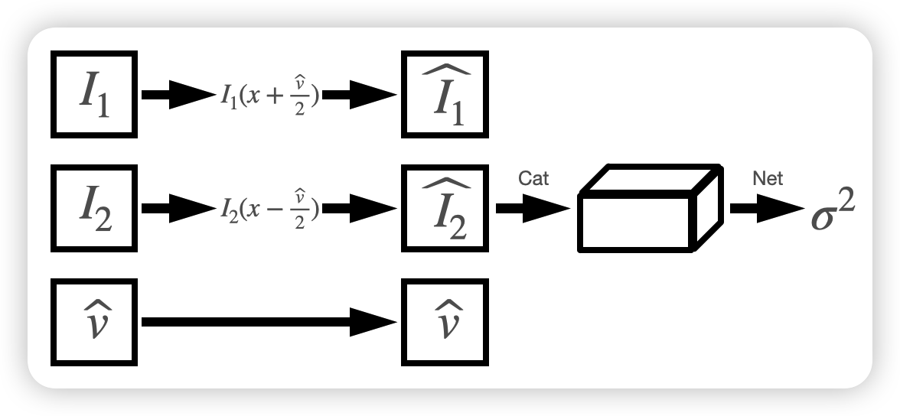

# UR(uncertainty of raft)

## 环境配置
python=`3.11`
```
conda install pytorch torchvision torchaudio pytorch-cuda=11.8 -c pytorch -c nvidia

pip install opencv-python
conda install matplotlib
conda install scipy
```
***
## 算法概述    
对RAFT的光流预测的置信度进行估计。
### Raft部分
输入：连续帧 $I_1$ 和 $I_2$   
输出：计算得到的速度场 $\widehat{v}$    
ground truth： $v_t$
### 预处理部分

将image1，image2，u，v，u_t, v_t进行拼接，这部分的数据集使用的是flyingchair
### Uncertainty部分
取一个期望为 $\mu$ 、方差为 ${\sigma}^2$ 的正态分布 $X \sim N(\mu, \sigma)$ ：  

$$
f(x)=\frac{1}{\sigma \sqrt{2 \pi}} e^{-\frac{(x-\mu)^2}{2 \sigma^2}}
$$   

对上式取对数：  

$$
\ln f(x)=-\frac{1}{2}\ln\big(2\pi {\sigma}^2\big)+\ln\big(-\frac{(x-\mu)^2}{2{\sigma}^2}\big)
$$      

化简后需要优化函数：   
$$loss=-\bigg(\frac{1}{2}ln{\sigma}^2+\frac{(v_t-\widehat{v})^2}{2{\sigma}^2+\xi}\bigg)$$
使loss最小，即可完成网络的训练。   
***

## 程序部分
### dataset
本项目的dataset基于flying-chairs数据集[flying-chairs](https://lmb.informatik.uni-freiburg.de/resources/datasets/FlyingChairs.en.html)。
